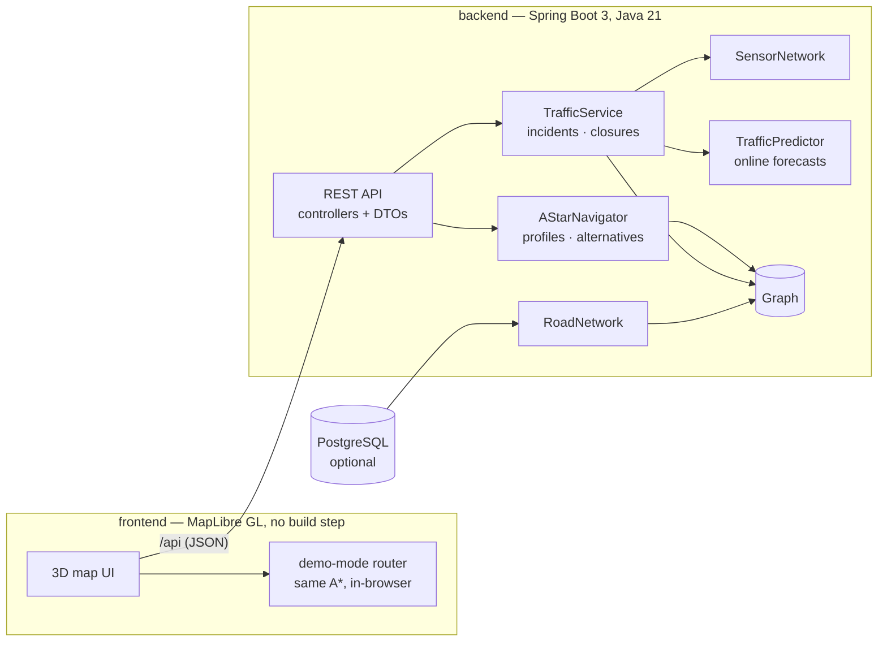

# Map Navigator

An intelligent navigation platform for central Bengaluru: live traffic simulation, roadside sensor fusion, incidents and road closures, weather, and predictive routing with ETA confidence — rendered on a 3D MapLibre map.

Pick any two points and get the fastest route for **right now**, or slide departure forward and get the route for **45 minutes from now**, computed against online-learned traffic forecasts instead of the current snapshot. Ask for the **shortest** or most **fuel-efficient** route instead, compare up to three alternatives, and report an accident or closure and watch routing react.

## Architecture



The routing and simulation core (`com.mapnavigator.core`, `com.mapnavigator.traffic`) has **zero dependencies** — it compiles and its full test suite runs with nothing but a JDK. Spring only wires it up and exposes it (`com.mapnavigator.web`).

```
backend/    Java 21 · Spring Boot 3 REST API over a framework-free core
frontend/   MapLibre GL 3D map UI (plain HTML/CSS/JS, no build step)
database/   PostgreSQL schema + seed data (optional network source)
```

## Features

**Routing.** A* over a pluggable cost model: `fastest` (predicted travel time), `shortest` (distance), `eco` (a fuel proxy — consumption modelled as a parabola around an efficient cruising speed, inflated by stop-and-go traffic). Each profile carries an admissible haversine heuristic, so results are optimal for the assumed traffic; the test suite cross-checks A* against a plain Dijkstra reference over **all 552 node pairs**. Alternative routes come from the penalty method: edges of accepted routes are inflated and the search re-run, keeping candidates that are meaningfully different and not absurdly slower. Contraction hierarchies and ALT were considered and deliberately skipped — they pay off on country-scale graphs and would fight the live per-query edge weights that make this system interesting.

**Live traffic.** Every 5 seconds `TrafficService` recomputes congestion per road segment: time-of-day baseline (rush peaks at 8–10 and 17–20) → local drift on sensor-instrumented segments → active incidents. Roadside sensors then *measure* the resulting state, including incidents, exactly as real hardware would.

**Incidents and closures.** Accidents inflate a road's congestion; closures remove it from routing until they expire. Both can be spawned by the simulation or reported through the API (and from the map UI — tap Report, then tap a road). The frontend re-routes automatically if a closure lands on the active route.

**Prediction.** `TrafficPredictor` learns online from every observation: a 24-bucket hourly profile per segment (slow EMA — the seasonal pattern), a fast-adapting short-term deviation with a 30-minute forecast half-life, and the variance of its own errors. Forecasts interpolate between hourly buckets so they vary smoothly by the minute. It correctly predicts both "the jam on MG Road will have cleared in an hour" and "but you'll hit Silk Board during evening rush." Heavier ML was evaluated and rejected: with one observation stream per edge, a seasonal exponential smoother matches anything a gradient-boosted or sequence model could learn here, at microsecond inference and zero dependencies.

**ETA confidence.** Each route's ETA ships with an ~80% band ("24 min ± 3"): every segment contributes its sensitivity to congestion times the predictor's forecast spread at the moment that segment would be driven, root-sum-squared and capped at ±35% of the ETA.

**Weather.** A sticky Markov chain over conditions with a network-wide speed factor — heavy rain slows every road by 30%, which changes ETAs and sometimes the chosen route. Swapping in a real provider (Open-Meteo, OpenWeatherMap) only requires replacing its `tick()`.

**Frontend.** MapLibre GL with Carto basemaps, extruded 3D buildings, pitch and rotation, dark and light themes. The signature element is the route ribbon drawn segment-by-segment **in its congestion colour** over the 3D city, with an animated reveal and a drive-replay marker (both respect `prefers-reduced-motion`). Panel UI covers profiles, departure slider, alternatives, turn-by-turn legs, incidents, saved places and history. Without a backend it drops into **demo mode**: the identical network and an equivalent A* (profiles, alternatives, closures included) run in the browser, so `index.html` works opened standalone.

## API

Base URL `http://localhost:8080/api`. Interactive docs at `/swagger-ui.html`, health at `/actuator/health`.

| Method | Path | Description |
| --- | --- | --- |
| GET | `/network` | Nodes and roads (with `oneWay` flags) for drawing the map |
| GET | `/route?from=1&to=9` | Best route on live traffic |
| GET | `/route?…&departIn=45` | Predictive route for departure in 45 min |
| GET | `/route?…&profile=eco` | `fastest` (default), `shortest`, or `eco` |
| GET | `/route?…&alternatives=3` | Up to 3 meaningfully different routes |
| GET | `/route?fromLat=…&fromLon=…&toLat=…&toLon=…` | Route between coordinates (snapped to nodes) |
| GET | `/traffic` | Congestion per segment + closed roads |
| GET | `/weather` | Current condition and speed factor |
| GET | `/sensors` | Latest roadside sensor readings |
| GET | `/incidents` | Active accidents and closures |
| POST | `/incidents` | Report one: `{"from":1,"to":2,"type":"closure","durationMinutes":30}` |
| DELETE | `/incidents/{id}` | Clear an incident early |
| GET | `/predict?from=1&to=2` | Learned 24h congestion profile for a road |
| GET/POST | `/users/{user}/places` | Saved places |
| DELETE | `/users/{user}/places/{id}` | Remove a saved place |
| GET/POST | `/users/{user}/history` | Recent routes |

Route responses put the best route's fields at the top level (backward compatible) and add `etaConfidenceMinutes`, `profile`, and an `alternatives` array. Errors are always `{"error": "…"}` with a proper 4xx/5xx status.

## Running it

### Docker (recommended)

```bash
docker compose up --build
# frontend on http://localhost:3000, API proxied same-origin under /api
```

Optional PostgreSQL-backed network:

```bash
DB_ENABLED=true docker compose --profile postgres up --build
```

### Locally

```bash
cd backend && mvn spring-boot:run      # API on http://localhost:8080
cd frontend && python3 -m http.server 3000   # or just open index.html
```

The header chip shows `live` when a backend is reachable, `demo mode` otherwise.

### PostgreSQL without Docker (optional)

```bash
createdb mapnavigator
psql -d mapnavigator -f database/PostgresDBSetup.sql
# then set db.enabled=true in backend/src/main/resources/application.properties
```

## Tests

The core suite needs only a JDK — no Maven, no network:

```bash
cd backend
javac -d target/core-tests \
    src/main/java/com/mapnavigator/core/*.java \
    src/main/java/com/mapnavigator/traffic/*.java \
    src/test/java/com/mapnavigator/*.java
java -cp target/core-tests com.mapnavigator.CoreTestSuite
```

53 checks: routing correctness (including the all-pairs Dijkstra cross-check), rerouting, closures, profiles, alternatives, simulation behaviour, forecast learning/decay/smoothness, and uncertainty. `mvn test` additionally runs `ApiSmokeTest` through the full Spring stack (MockMvc). CI runs both plus the Docker image builds on every push.

## Configuration

| Property | Default | Meaning |
| --- | --- | --- |
| `sim.tick-ms` | `5000` | Simulation heartbeat |
| `sim.warmup-days` | `3` | Simulated days replayed at startup to warm the predictor |
| `cors.allowed-origins` | `*` (dev) / empty (prod) | Comma-separated origins; empty disables CORS (same-origin proxy) |
| `db.enabled` / `db.url` / `db.user` / `db.password` | embedded network | PostgreSQL network source |

The `prod` profile adds graceful shutdown, response compression and trims actuator exposure to health.

## Technology

Java 21 · Spring Boot 3 (web, actuator) · springdoc-openapi · PostgreSQL (optional, plain JDBC) · MapLibre GL JS · Carto basemaps · nginx · Docker Compose · GitHub Actions.

## Future improvements

- Load a real OSM extract instead of the 24-node demo network (the core already handles one-way roads and per-edge speeds)
- Turn restrictions and lane-level penalties at junctions
- Persist saved places and history through the existing PostgreSQL schema
- Real weather and incident feeds behind the current service interfaces
- WebSocket push for traffic updates instead of 5-second polling
